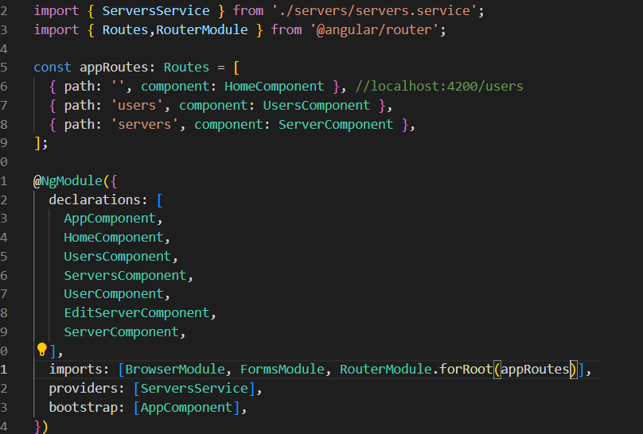
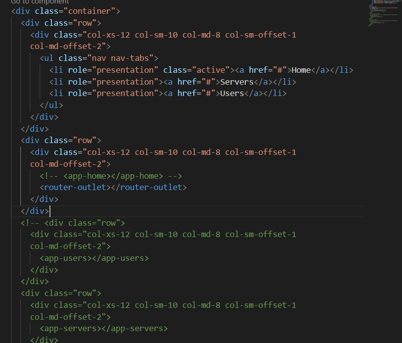
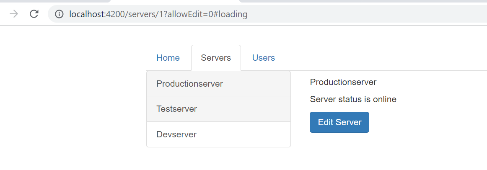
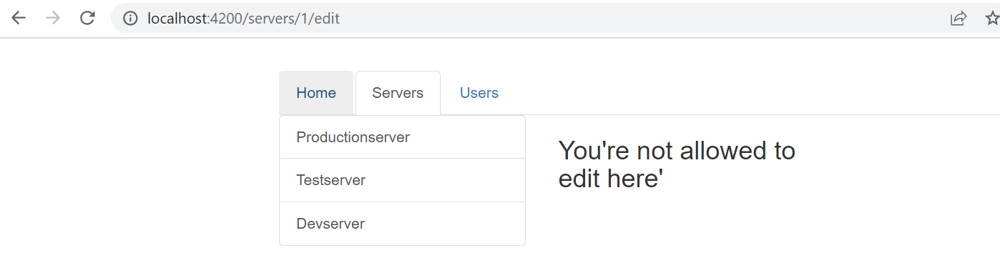
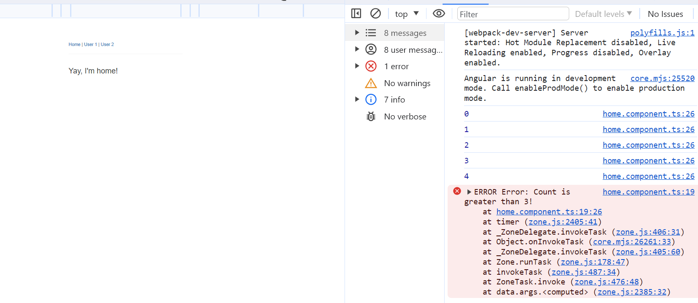
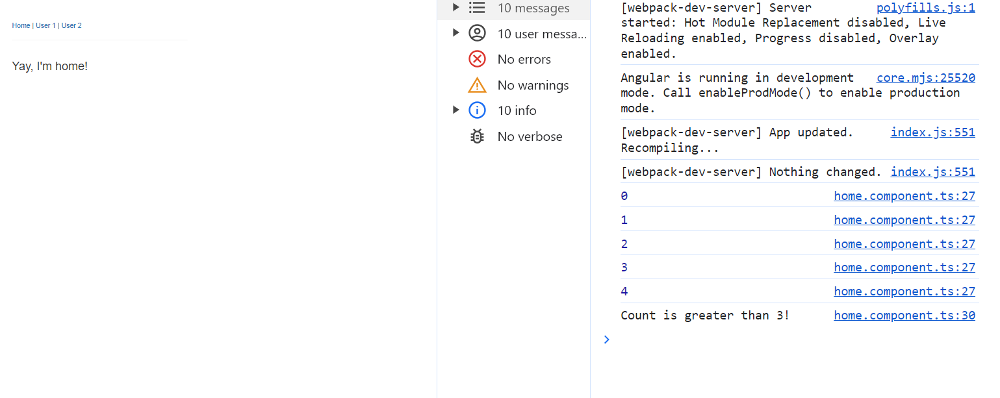
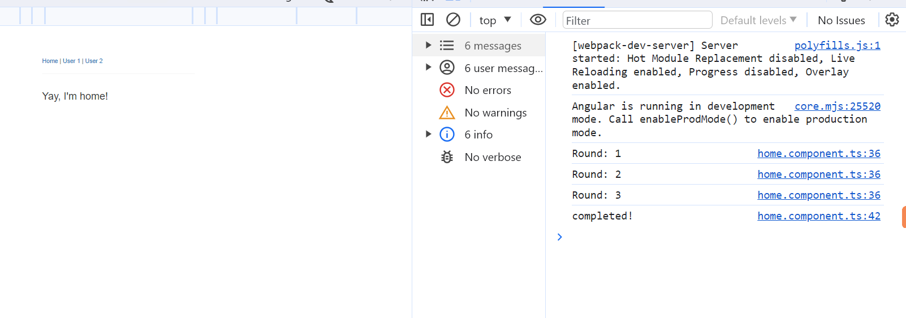

# Notes for Angular

### Basic Selector access in angualr

---

- In Angular selectors like this `<app-angular> </app-angular>` we can mention in html and we can declare that in ts file inside @Componet decorator with key of "selector"
  `{selector: 'app-angular'} ` or `{selector: '[app-angular]'}`
  simple `app-angular` will be accessed as above html tag or using this selector as a class but if we access same selector as attribute like this `[app-angular]` then we should access it in html like this `<div app-angular > </div>` in the html page

note: selecting selector by id won't work in angular.

### Data Binding

---

- Interpolation

  - String interpolation can be done directly in angular byt defining a variable in the ts file like this `theVriable:String;` and then you can access it by two curlly braces "{{}}" in the html like this `{{theVriable}}`.

  - One another way is we can call the function inside the interpolation braces which can return string or number or whatever which can be readable to us. e.g defining function in ts file `testFunc(){return this.theVriable}` now utilizing this function in the html page like this `{{testFunc()}}` and it'll print the value of `theVariabe`'s value.
  - Note: String interpolation can be used like this in html page `<p>{{theVariabe}}</p>`

- Property Bindings

  - In angular `[]` square brackets indicates propety bindings where we can bind value of varible to an attribute
    like this

  ```ts
    //ts
    newVariable:Boolean = false;
  //html
  <button [disabled] ="newVariable"  >Click Me </button>
  ```

  where value of `newVariable` can be changed with the help of a funtion where it's boolean value gets changed to `true` hence button will be getting disabled there after.

- Event Binding

  - in angular we use eevrnts inside html tag like this `(click)="abcFun()"` so on click this event will be triggered.
  - there is also a type of event `(inpur)="testFunc($event)` where input event will be triggered at every key strokes which will give `$event` all the values and thus which we can access those. by simply using event.target.value ="xyz".

- Two Way Data Binding

  - Important: you need to enable the` ngModel` directive. This is done by adding the `FormsModule` to the `imports[]` array in the` AppModule`.You then also need to add the import from `@angular/forms` in the `app.module.ts` file:
    `import { FormsModule } from '@angular/forms';`
  - as you read `ngModel`, it will be working inside these brackets `[()]` this will help us to give two way binding, as `[]` is used for to bind properties from ts and `()` will give values from the `<input/>` tags whatever we write to the ts file.
  - note: ngModel is one of the directives.

  ***

### Directives

---

- Directives are instruction in the DOM(Document Object Model).

- ngIf

  - used for to show conditionally show things on html page e.g. `*ngIf = "true or False"`, if it's tru then it'll show things other wise it'll hide all the tag of html.
    Note: Here `*` is added in front of the `ngIf` because it's a structural directive as it chnages the structure of DOM.
    in Place of `true` or ` false` we can declare boolean variable in the ts file to \*ngIf directive also.

- ngIf with else(structural directive)

  - else tag can be accessed if our first condition in the \*ngIf directives gets false value then it'll go to the eles condition.

  ```html
  <p>This is a html tag</p>
  <span #spanTag> this is also a html tag but in-line one</span>
  ```

  suppose there is boolean variable in the ts file `testVariable:Boolean = false;` which we'll use here. and `#spanTag` we can say as local reference or you can as Id.

  ```html
  <p *ngIf="testVariable">This is a html tag</p>
  <span #spanTag> this is also a html tag but in-line one</span>
  ```

  but here we have to bring some thing called
  `<ng-template>`

  ```html
  <p *ngIf="testVariable">This is a html tag</p>
  <ng-template #spanTag> <span #spanTag> this is also a html tag but in-line one</span></ng-template>
  ```

  here `<ngtemplate>` work as a marker if for ngIf else's condition. and now We have to just put else condition in the \*ngIf directive.

  ```html
  <p *ngIf="testVariable; else spanTag">This is a html tag</p>
  <ng-template #spanTag> <span #spanTag> this is also a html tag but in-line one</span></ng-template>
  ```

  and that's it.

- ngStyle(attribute directive) or without \*

  - It's a directive where style get rendered on the basis of conditions, which we get from the ts file. e.g.
    let's create some variables and function

  ```ts
  testVariable: Boolean = true;
  colorFirst:String = '#1C1C1C'
  colorSecond:String = '#FFFFFF'

  //other codes in this file

  getColor(){
     testVariable ?  colorFirst :  colorSecond;
  }

  ```

  so here we'll be binding this function to th `ngStyle` directive now in the html page.

  ```html
  <button [ngStyle]="{backgroundColor:getColor()}">Click Me</button>
  ```

  so something like this you'll give conditional color to the html tag whenever you want to as required in the project.
  note: here `[]` we are using as we're binding data to the directive.

- ngClass(attribute directive)

  - ngClass objective is to dyanamically add or remove css classes.
  - This is also work as to binding the data with `[]`.

  - let's create a CSS pseudo

  ```css
  .jasper {
    color: #f89fc8;
  }
  ```

  now we''' use the same html tag as above to access this css class based on the condition of our ts file.

  ```ts
  testVariable: Boolean = true;
  colorFirst:String = '#1C1C1C'
  colorSecond:String = '#FFFFFF'

  //other codes in this file

  getColor(){
     testVariable ?  colorFirst :  colorSecond;
  }

  ```

  now using the same html page

  ```html
  <button [ngStyle]="{backgroundColor:getColor()}" [ngClass]="{jasper: testVariable === true }">Click Me</button>
  ```

  - Here if testvariable condition gets true , then ngClass will add that class to the html tag otherwise it'll remove it.
    and `color` property will be applied accordingly.

- ngFor(structural directive)

  - It's also a structrual directive where we loop through the array elements to the html tag and create html component as the number of elemetns present in it.

  ```ts
  import { Component } from "@angular/core";
  @Component({
    selector: "app-example",
    template: `
      <h2>List of Fruits:</h2>
      <ul>
        <li *ngFor="let fruit of fruits">{{ fruit }}</li>
      </ul>
    `,
  })
  export class ExampleComponent {
    fruits: string[] = ["Apple", "Banana", "Orange", "Mango", "Grapes"];
  }
  ```

  now we need to add the `ExampleComponent` to the `ngModule`

  ```ts
  import { NgModule } from "@angular/core";
  import { BrowserModule } from "@angular/platform-browser";

  import { AppComponent } from "./app.component";
  import { ExampleComponent } from "./example.component";
  // Import the component here

  @NgModule({
    declarations: [
      AppComponent,
      ExampleComponent, // Declare the component here
    ],
    imports: [BrowserModule],
    providers: [],
    bootstrap: [AppComponent],
  })
  export class AppModule {}
  ```

  now comes the mail html part

  ```html
  <!DOCTYPE html>
  <html>
    <body>
      <app-example></app-example>
    </body>
  </html>
  ```

  here `app-example` selector get rendered as component in the html page.
  and when you run the angular code you'll see the results in the browser page as

  ```linux
  Apple
  Banana
  Orange
  Mango
  Grapes
  ```

  note: in \*ngFor we can also add the index

```html
<li *ngFor="let fruit of fruits; let i = index">{{i+1}}. {{ fruit }}</li>
```

here every iteration will give the unique index which we can also used as the `key` for the tag so that there will not be any duplicate value.

### Note:

- To add any style sheet, after installing you have to mention the stylesheet location in the `angular.json` inside `styles[]`. e.g.

```json
"styles":[node_modules/bootstrap/dist/css/bootstrap.min.css,style.css
]

```

similarly we can add any neccessary style library in here.

### Custom Properties and Events

---

- Custom Property Binding

  - This will be used to create custome properties binding when we're binding data between two components.
    e.g.

  ```html
  <!-- app.component.html -->
  <app-server-element *ngFor="let serverEle of serverElements" [srvEle]="serverEle" [name]="serverEle.name"> </app-server-element>
  ```

  here we're binding sevEle to `serverEle` which will pass data inside the `app-server-element` selector.

  which is like this

  ```ts
  //defining the type of the object in server.element.ts
   @Input('srvEle') element:{
    type:string,
    name:string,
    content:string
  };
  ```

  where it'll pass data to its own html component.

  hence we're passing data from `parent to child` or you can say we did ` little state management` here.

  ### Note:

  - but to make explicit notice so that parent is able to transfer data to its child we have to include `@input` decorator in the child's ts file. so that it can acknowledge the property binfing. like this

  ```ts
  @Input('srvEle') element:{
    type:string,
    name:string,
    content:string
  };
  ```

  here we are giving alias as `srvEle` and same we can mention in the html tag with the same name or you can name whatever name you want to.

- Binding Custom Events

  - Here we'll do exactly the opposite of above where we were passing the data from parent to child , here we'll be doing the opposite.
  - here in child componet we'll create a function, and after the execution of that function we'll emit an event inside the child function (that event will be our custom event).
  - and we'll be binding that custom event to our parent component with parents's function.
  - hencE in a jist, when child's function get executed which will emit an event or will trigger an custom event that we're binding to the parent's component and thus it'll do that whatever activity you want in your parent component.

    - to show with an example, let's start with our child component
      this is out ts file

    ```ts

    newServerName = '';
    newServerContent = '';
     @Output('screated') serverCreated = new EventEmitter<{
      serverName: string,
     serverContent: string
      }>();
      @Output('bpcreated') blueprintCreated = new EventEmitter<{
       serverName: string,
     serverContent: string
      }>();


      onAddServer() {
    this.serverCreated.emit({serverName: newServerName, serverContent: this.newServerContent});
    }
    onAddBlueprint() {
    this.blueprintCreated.emit({serverName: this.newServerName, serverContent: this.newServerContent });
    }
    ```

    here you'll notice we're using `@Output` which will notice parent that , this child will be sending the data when it emit event like this

    ```ts
    this.blueprintCreated.emit({ serverName: this.newServerName, serverContent: this.newServerContent });
    ```

### Note

- every output decorator has `EventEmitter` which has generic type of the data we'll be sinding here. like this

```html
{ serverName: string, serverContent: string }
```

and now I'll show how it'll look like in the the parent.
this is parent's component(html page).

```html
<app-cockpit (screated)="onServerAdded($event)" (bpcreated)="onBlueprintAdded($event)"></app-cockpit>
```

so as you can see it's our custom event name `screated` and `bpcreated`.
now we have two functions that will be called when these events are emitted by the child components.

now let me show you tha ts fie of the parent component.

```ts
   serverElements = [
  {
    type: 'server',
    name: 'testServer',
    content: 'this is a test!'
  }
  ];


  onServerAdded(serverData: {
    serverName: string,
    serverContent: string
  }) {
    this.serverElements.push({
      type: 'server',
      name: serverData.serverName,
      content: serverData.serverContent
    });
  }

  onBlueprintAdded(bluePrintData: {
    serverName: string,
    serverContent: string
  }) {
    this.serverElements.push({
      type: 'blueprint',
      name: bluePrintData.serverName,
      content: bluePrintData.serverContent
    });
  }
```

so this is how child to parent data transfer is being done in angular using event.

### Local Referrence

---

- local reference can be shown here by e.g.

```html
<input type="text" class="form-control" #serverNameInput />
```

Here `#serverNameInput` is a local refernce of the `input` tag
. local referece can be of any html tag.

- we can only use `this` local referece in the the html template but not in ts file.
  e.g.

```html
<button class="btn btn-primary" (click)="onAddServer(serverNameInput.value )">Add Server</button>
<!-- or we can use it like this in simple way -->
<button class="btn btn-primary" (click)="onAddServer(serverNameInput )">Add Server</button>
```

like this

and we can acces the localreferece value in the ts file

```ts
   onAddServer(nameInput:any ) {

    this.serverCreated.emit({serverName: nameInput, serverContent: this.serverContentInput?.nativeElement?.value });

  }

  //like this or this respectively
  onAddServer(nameInput : HTMLInputElement) {

    this.serverCreated.emit({serverName: nameInput.value, serverContent: this.serverContentInput?.nativeElement?.value });

  }
```

- ViewChild() decorator

  - If We do not want to use local referece in the html only but in the ts file also, then there is a way with `@ViewChild()` decorator.
  - it'll access the local referece just like above html tag

  ```html
  <input type="text" class="form-control" #serverNameInput />
  ```

  - and we can acces it in the ts file like below
  - ```ts
          @ViewChild('serverNameInput', {static: true}) serverNameInput: ElementRef;
          // here  serverNameInput is a type of  ElementRef
    ```

    add { static: true } as a second argument needs to be applied to ALL usages of @ViewChild() (and also @ContentChild() which you'll learn about later) IF you plan on accessing the selected element inside of ngOnInit().

    If you DON'T access the selected element in ngOnInit (but anywhere else in your component), set static: false instead!

    If you're using Angular 9+, you only need to add { static: true } (if needed) but not { static: false }.

  - but to use its value in the ts file we have to use it like this .

    ```ts
    console.log(this.serverContentInput?.nativeElement?.value);
    ```

    -note: if you want to get the element value without any error handling, then use **?** operator

  - so serverContentInput value is inside the `nativeElement`

- ng-Content

  - this is used when you want to send a complex html code into a component, from the parent to the child we use this.

  - let me share a example
    this is `server.component.html` file before

  ```html
  <div class="panel panel-default">
    <!-- <div class="panel-heading">{{ element.name }}</div> -->
    <div class="panel-heading">{{ name }}</div>
    <div class="panel-body">
      <p>
        <strong *ngIf="serverEle.type === 'server'" style="color: red">{{ srvEle.content }}</strong>
        <strong *ngIf="serverEle.type === 'blueprint'">{{ srvEle.content }}</strong>
      </p>
    </div>
  </div>
  ```

  - and `app.component.html` before was like this.

  ```html
  <app-server-element *ngFor="let serverEle of serverElements" [srvEle]="serverEle" [name]="serverEle.name"> </app-server-element>
  ```

  - and this is after how both the files will look withthe use of `ng-conent`

  ```html
  <!-- server.component.html -->
  <div class="panel panel-default">
    <!-- <div class="panel-heading">{{ element.name }}</div> -->
    <div class="panel-heading">{{ name }}</div>
    <div class="panel-body">
      <ng-content></ng-content>
    </div>
  </div>
  <!-- app.component.html -->
  <app-server-element *ngFor="let serverEle of serverElements" [srvEle]="serverEle" [name]="serverEle.name">
    <p>
      <strong *ngIf="serverEle.type === 'server'" style="color: red">{{ serverEle.content }}</strong>
      <strong *ngIf="serverEle.type === 'blueprint'">{{ serverEle.content }}</strong>
    </p>
  </app-server-element>
  ```

  - so basically `ng-content` tag will inject the app component html tags which are inside the selector of child component , into the child's own component.
    this way we can transfer any kind of html to the child from the parent using it.

### LifeCycle Hooks

---

- just read this pdf [View PDF](C:\learning\newapp\newapp\src\assets\lifecycle.pdf)

### Content Child

---

- It's similar to the viewchild in case of working but, it's not applied to the childs own component but at parents component specifically inside the selector of child's. like this.

```html
<app-server-element *ngFor="let serverEle of serverElements" [srvEle]="serverEle" [name]="serverEle.name">
  <p #paragraph>
    <strong *ngIf="serverEle.type === 'server'" style="color: red">{{ serverEle.content }}</strong>
    <strong *ngIf="serverEle.type === 'blueprint'">{{ serverEle.content }}</strong>
  </p>
</app-server-element>
```

here I'm mentioning the local refrrence in the `app.component.ts` which inside the selctor of its child.

and we are accessing the content inside the selector with using that `#paragraph` referece inside the child ts file like this.

```ts
  @ContentChild('paragraph', {staitc:true}) paragraph : ElementRef;
  ngOnIt(){
    console.log("this is data", this.paragraph.nativeElement.TextContent)
  }
```

- here we are acces the text content from the parents coponent usinf local reference, but inside the ng-content's selector to be precise.

- just to add it's value will be visible after the lif cycle "afternGcontnentinit" hook is initialised.

---

## Part 2

### Custom Directives

---

- We make custom directive with a `@Directive()` like this like we add decorator `@Component` on every component of angular.

- But to configure a Directive we have to pass an object inside it like this.

```ts
@Directive({})
export class ServerElementDirective implements OnInit, {...
```

- One thing a `Directive` needs a selector.

It can't work without one. So let's give our directive a name .

```ts
@Directive({selector: [appServerElementDirective]})
export class ServerElementDirective implements OnInit, {...
```

- And to provide something through the directive we have to inject something in this directive like this in a e.g.

```ts
@Directive({selector: [appServerElementDirective]})
export class ServerElementDirective implements OnInit, {
  constructor(private elementref:ElementRef){}
  ngOnIt(){
    this.elementref.nativeElement.style.backgroudnColour = 'green'
  }
```

- Now We have to use this directive to implement its working,Note: Do remember to implement this ts class in the app.module.ts in the declarations array.

```html
<p appServerElementDirective>Style it with your directive</p>
```

- Note: since we have given selector as `[appServerElementDirective]` that's why we're able to use it as attribute in the p tag.

- But there is better verison of the directive which is by Using "Renderer". which is used as like this:

  ```ts

  @Directive({selector: [appServerElementDirective]})
  export class ServerElementDirective implements OnInit, {
  constructor( private renderer: Renderer2,private elementref:ElementRef){}
  ngOnIt(){
    this.renderer.setSytle( this.elementref.nativeElement, 'backgroudnColour' , 'green')

  }
  ```

  here , renedrer is better approach as it takes values as parameters int he function, 1st parameter is about element,2nd is about type of style, 3rd is the value we would like to assign the value to the type of style, and 4th is optional but can be important sometimes, where we can use flags like `!important` to Css styles.

---

### Host Listners

- to occuer a event on element tag where a directive sits on, the best way to do it is by `@HostListners()` Decorator.
  e.g
  we add it to some function so that on that event that function also should trigger.
  here I'll be using tha above directive example to set style in the event function

```ts
@HostListners('mouseenter') functionName(eventData:Event){
   this.renderer.setSytle( this.elementref.nativeElement, 'backgroudnColour' , 'green')
}
```

here `mouseenter`is considered as event which will trigger when we hover the mouse on it.and it'll hit the seStyle function .

### Host Binding

- There is nothing wrong to use renderer but, there is easier way if we only want to change e.g. background colour.
  then we use `@HostBinding` decorator.
  where we use it like this.

```ts
@HostBinding('style.backgroundColor') backgroundColor:string = 'transparent';
```

here `@HostBinding` using the host element's `style.backgroundColor` to access the it and change the color wherever we want we can change it in the HostListner though like this .

```ts
  @HostListners('mouseenter') functionName(eventData:Event){
  //  this.renderer.setSytle( this.elementref.nativeElement, 'backgroudnColour' , 'green')
   this.backgroundColor  = '#dfe99s'
}
```

### Dyanamic Directive

- In this part we'll be changing the data from the user which can reflect the change dyanamically using the directive by the user.

by using @Input and we will use it like dyanamically to pass data dyanamically and setting it.
e.g.

```ts
  @Input() testStyle:string = 'transparent'
  @Input() testStyleTwo:string = 'transparent'

  @HostBinding('style.backgroundColor') backgroundColor:string = this.testStyle;
   @HostListners('mouseenter') functionName(eventData:Event){
  //  this.renderer.setSytle( this.elementref.nativeElement, 'backgroudnColour' , 'green')
   this.backgroundColor  = this.testStyleTwo;
}
```

---

### Custom Structural Directive

- to create our own directive in ts file we need to bring `templateRef` and `ViewContainerRef` in the constructor.
- basicaly we need `ViewContainerRef` to create a view in the screen and in that created view we'll pass our template.
- we can do like this

```ts


@Directive({
  selector: ['abcd'],
})
export class YourDirectiveName {

  @Input() set abcd(condition:boolean){
    if(!condition){
      this.vcRef.createEmbbededView(this.templateRef);
    }else{
      this.vcRef.clear();
    }

    construtor(private templateRef:TemplateRef<any>, private vcRef:ViewContainerRef  ){
    }
  }


}
```

- here as you can see i'm ijecting the dependency of the `templateRef` and `ViewContainerRef` and setting the `@input` Directive whenever something changes in this case it's a condition, where on false i'll run the first condition and in else I'll run the false condition.

and in html I can use that directive as like this

- Note: we have to keep the function name and property name as same as `abcd` in `@input` directive as well. to run it

```html
<div *abcd="checkTrueOrFalse"></div>
```

---

### ngSwitch Directive

- It's a basically same as switch case but we apply it on html level.

```html
<!-- value  can be number or string which can be defined in the ts file -->
<div [ngSwitch]="value">
  <p *ngSwitchCase="5">Value is 5</p>
  <p *ngSwitchCase="10">Value is 10</p>
  <p *ngSwitchCase="15">Value is 15</p>
  <p *ngSwitchCase="20">Value is 20</p>
  <p *ngSwitchDefault>Value is Default</p>
</div>
```

- with the chnages of the value it'll show the respective value. It Can be really usefull in some cases.

---

## Service

### Cross communication using service

- In service we can create an event emitter which we can emit in one component and we can subscribe in another component.

```ts
//emitting in this component
export class RecipeItemComponent {
  @Input("recipe") recipe: Recipe;
  // @Output() recipeSelected = new EventEmitter<void>();

  constructor(private _recipeService: RecipeService) {}
  onSelectdItem() {
    // this.recipeSelected.emit();
    this._recipeService.recipeSelected.emit(this.recipe);
  }
}

//listening in this component
export class RecipesComponent implements OnInit {
  selectedRecipeDetail: Recipe;
  constructor(private _recipeService: RecipeService) {}

  ngOnInit() {
    this._recipeService.recipeSelected.subscribe((recipe: Recipe) => {
      this.selectedRecipeDetail = recipe;
    });
  }
}
```

---

## Routing

### Router Outlet Tag

---

- first we hve to mention the routings in the Parent's routing module or parent's module.
  like this.



- then in the parent's html component add `<router-outlet></router-outlet>` tag where you want your other child components to load when you hit the URL.
  like this.



- then on accessing respective routes of the child component it'll load up here in place of `<router-outlet></router-outlet>`;

### Router Link

---

- we can use `routerLink` in the html and can place our url ends.
  like this `routerLink="/users"`.
- Also when there are many tab buttons and we want it to be look like active then we can also inculde the navigating styling with the help of `routerLinkActive="active"` here in place of active we can place our own custom class of css that can load up there.

- Also for the route `''`, ye for empty route it'll be always active so for that we have to give command accordingly like this `[routerLinkActiveOptions]="{exact:true}"` it'll remove the always acive button sign here.

- Alos we can do routing programmaticcaly we can import the class of `Router` and the we can call the function from the button using any event then we can do the routing like this.

```ts
avigateTobasicAssessment() {
    this.router.navigate(['/account/basic-assessment']);
  }
  // or
  avigateTobasicAssessment() {
    this.router.navigate(['/account','basic-assessment']);
  }
```

- We also have a option of ` this.router.navigate(['basic-assessment'], {relativeTo:this.route});` where `this.route` we're getting from inbuild angulars's `ActivatedRoute` which we can initialise from constructor.

- To get the id from the URL of the route we can use `ActivatedRoute`. when path is like this .
  `{ path: 'users/:id', component: UserComponent }, //for getting individually user`

## get data from route params

- to get data from route params eg.`https://abcd.com/test/10/lol`
  we can fetch the values `10` and `lol` with the help of `ActivatedRoute` using
  like this.

```ts
export class UserComponent implements OnInit {
  user: { id: number; name: string };

  constructor(private route: ActivatedRoute) {}

  ngOnInit() {
    this.user = {
      id: this.route.snapshot.params['id'],
      name: this.route.snapshot.params['name'],
    };

    // better use this one
    this.route.params.subscribe((params) => {
      this.user.id = params['id'];
      this.user.name = params['name'];
    });
  }
```

- prefer better one to get the values and then you can print it on the html page using string inter polation.

---

## qurey params.

- it adds the `?=` symbol in the end of activated route and wil add query params value after that.
- also you can add fragment int hat route also
  like this
  'it's for using it on the html and can also use in the the js or ts file

```html
<a [routerLink]="['/servers', 10, 'edit']" [queryParams]="{allowEdit:'1'}" [fragment]="'loading'" href="#" class="list-group-item" *ngFor="let server of servers"> {{ server.name }} </a>
```

```ts
 onLoadServer(id: number) {
    this.router.navigate(['/servers', id, 'edit'], {
      queryParams: { allowEdit: 1 },
      fragment: 'loading',
    });
 }
```

- and if you want to fetch data from it in your code then you can do this

```ts
this.route.queryParams.subscribe();
this.route.fragment.subscribe();
```

- Clear Doubt on route.snashot.params vs raute.params

---

# Discovery Note

- here

```ts
const id = +this.route.snapshot.params["id"];
this.server = this.serversService.getServer(id);
this.route.params.subscribe((param) => {
  this.server = this.serversService.getServer(+param["id"]);
});
```

- To convert string to the number just put `+` in front of them, you cans see the examples above. for the conversion.

---

## Router inside Router

---

- in app-routing.module.ts file you can see routings like these

```ts
const appRoutes: Routes = [
  { path: "", component: HomeComponent }, //localhost:4200/users
  { path: "users", component: UsersComponent },
  { path: "users/:id/:name", component: UserComponent }, //for getting individually user
  { path: "servers", component: ServersComponent },
  { path: "servers/:id", component: ServerComponent },
  { path: "servers/:id/edit", component: EditServerComponent },
];
```

- But here we can see `users` and `servers` as the parent url route.and contains multiple route which we combine them. like this under the children array.

```ts
const appRoutes: Routes = [
  { path: "", component: HomeComponent }, //localhost:4200/users
  { path: "users", component: UsersComponent },
  { path: "users/:id/:name", component: UserComponent }, //for getting individually user
  {
    path: "servers",
    component: ServersComponent,
    children: [
      { path: ":id", component: ServerComponent },
      { path: ":id/edit", component: EditServerComponent },
    ],
  },
];
```

- And these child routes need a separate routes beacuse `router outlet` will now show only parent or top level routes not childrens.
- here the child component will be having the router outlet in thier own parent component. e.g `/servers`

To see whole code:
before:

```ts
<div class="row">
  <div class="col-xs-12 col-sm-4">
    <div class="list-group">
      <!-- <a [routerLink]="['/servers', server.id, 'edit']" [queryParams]="{allowEdit:'1'}" [fragment]="'loading'" href="#"
        class="list-group-item" *ngFor="let server of servers">
        {{ server.name }}
      </a> -->
      <a [routerLink]="['/servers', server.id]" [queryParams]="{allowEdit:'1'}" [fragment]="'loading'" href="#"
        class="list-group-item" *ngFor="let server of servers">
        {{ server.name }}
      </a>
    </div>
  </div>
  <div class="col-xs-12 col-sm-4">
    <app-edit-server></app-edit-server>
    <hr>
    <!-- <app-server></app-server> -->
  </div>
</div>
```

After

```ts
<div class="row">
  <div class="col-xs-12 col-sm-4">
    <div class="list-group">
      <!-- <a [routerLink]="['/servers', server.id, 'edit']" [queryParams]="{allowEdit:'1'}" [fragment]="'loading'" href="#"
        class="list-group-item" *ngFor="let server of servers">
        {{ server.name }}
      </a> -->
      <a [routerLink]="['/servers', server.id]" [queryParams]="{allowEdit:'1'}" [fragment]="'loading'" href="#"
        class="list-group-item" *ngFor="let server of servers">
        {{ server.name }}
      </a>
    </div>
  </div>
  <div class="col-xs-12 col-sm-4">
    <!-- <app-edit-server></app-edit-server>
    <hr>
    <app-server></app-server> -->
    <router-outlet></router-outlet>
  </div>
</div>

```

- As you can see child selectors are replaced by the router outlet.
  -This is how we do router inside the router.

## To preserve the query params after click

- As you can ee here in the image the qurey params and



- but as soon as I click on the `Edit Server`

query params got removed like this


and to stop this we can do this .

- Now on clicking on the `Edit Server` button we can use this.

```ts
onEdit() {
    this.router.navigate(['edit'], { relativeTo: this.route, queryParamsHandling: 'preserve' }); //as we are on relative path itself
  }
```

---

## Wild Card Routes

```ts
{ path: 'not-found', component: PageNotFoundComponent },
  { path: '**', redirectTo: '/not-found' }, //keep this at the end all the time
```

---

## Guarding the Routes

- To guard the route we have to create a service `auth-guard.service.ts`, you can name any though.
- In this service we implement two interfaces `CanActivate` and `CaActivateChild`, implenations functions of these two interfaces helps to guard the route.

- After creatig this service, we have to create another service where we keep functions an variables check for the authentication of the user.

here is the service of authentican.

```ts
export class AuthService {
  loggedIn = false;

  isAuthenticated() {
    const promise = new Promise((resolve, reject) => {
      setTimeout(() => {
        resolve(this.loggedIn);
      }, 800);
    });

    return promise;
  }

  login() {
    this.loggedIn = true;
  }
  logout() {
    this.loggedIn = false;
  }
}
```

- Above login logout and isAuthenticated functions are used in the comaponent where user gets logged for e.g. login component.

- Now here is the code for the `auth-guard` service.

```ts
import { Injectable } from "@angular/core";
import { ActivatedRouteSnapshot, CanActivate, CanActivateChild, Router, RouterStateSnapshot, UrlTree } from "@angular/router";
import { Observable } from "rxjs";
import { AuthService } from "./auth.service";
@Injectable()
export class AuthGuard implements CanActivate, CanActivateChild {
  constructor(private authService: AuthService, private router: Router) {}
  canActivateChild(childRoute: ActivatedRouteSnapshot, state: RouterStateSnapshot): boolean | UrlTree | Observable<boolean | UrlTree> | Promise<boolean | UrlTree> {
    // throw new Error('Method not implemented.');
    return this.canActivate(childRoute, state);
  }

  canActivate(route: ActivatedRouteSnapshot, state: RouterStateSnapshot): boolean | Observable<boolean | UrlTree> | Promise<boolean | UrlTree> {
    return this.authService.isAuthenticated().then((authenticated: boolean) => {
      if (authenticated) {
        return true;
      } else {
        this.router.navigate(["/"]);
        return false;
      }
    });
  }
}
```

- As you can see above service have two functions `canActivate` and `canActivateChild` which are calling the `isAuthenticated` function from `AuthService` which will return promise as `true` or `false` as return.

- Now we have to implement these in the `routing` modules or whever we want to apply the routeguard in other routing modules.
  for example like this.

```ts
 {
    path: 'servers',
    // canActivate: [AuthGuard],
    canActivateChild: [AuthGuard],
    component: ServersComponent,
    children: [
      { path: ':id', component: ServerComponent },
      { path: ':id/edit', component: EditServerComponent },
    ],
  },
  { path: 'not-found', component: PageNotFoundComponent },
  { path: '**', redirectTo: '/not-found' },

```

- `canActivateChild: [AuthGuard],` applied on the child of the parent components and `canActivate: [AuthGuard],` for parent components.

---

### canDeactivate()

- This function asks user to, do you really want to leave the current page.
  beacuse after leaveing the he might need to login or whatever the logic developer made on that.

  here it's similar to the making service of `AuthGuard` just its unique at implementation part.

  ```ts
  import { ActivatedRouteSnapshot, CanDeactivate, RouterStateSnapshot, UrlTree } from "@angular/router";
  import { Observable } from "rxjs";

  export interface CanComponentDeactivate {
    canDeactivate: () => boolean | UrlTree | Observable<boolean | UrlTree> | Promise<boolean | UrlTree>;
  }

  export class CanDeactivateGuard implements CanDeactivate<CanComponentDeactivate> {
    canDeactivate(component: CanComponentDeactivate, currentRoute: ActivatedRouteSnapshot, currentState: RouterStateSnapshot, nextState?: RouterStateSnapshot): boolean | UrlTree | Observable<boolean | UrlTree> | Promise<boolean | UrlTree> {
      // throw new Error('Method not implemented.');

      return component.canDeactivate();
    }
  }
  ```

  - As you can see "CanDeactivate<CanComponentDeactivate>" her it calling the function defined in the interface of "CanComponentDeactivate" and "CanComponentDeactivate" this interface we haven to implement in the component where we want use this `canDeactivate` Guard.

  -- here as yo can see in one of the component I'm using it like this.

  ```ts
  export class EditServerComponent implements OnInit, CanComponentDeactivate {.....

  <!-- and this "CanComponentDeactivate" will want me to implement "canDeactivate()" -->

  <!-- So I have done like this -->
   canDeactivate():
    | boolean
    | UrlTree
    | Observable<boolean | UrlTree>
    | Promise<boolean | UrlTree> {
    if (!this.allowEdit) {
      return true;
    }

    if (
      (this.serverName !== this.server.name ||
        this.serverStatus !== this.server.status) &&
      !this.changesSaved
    ) {
      return confirm('Do You want to discard the changes?');
    } else {
      return true;
    }
  }
  ```

  - remeber to give return type to the function same as in the deactivate guard service.

  - now you can simply add the guard to the routing module like this.

  ```ts
   {
    path: 'servers',
    // canActivate: [AuthGuard],
    canActivateChild: [AuthGuard],
    component: ServersComponent,
    children: [
      { path: ':id', component: ServerComponent },
      {
        path: ':id/edit',
        component: EditServerComponent,
        canDeactivate: [CanDeactivateGuard],
      },
    ],
  },
  <!-- also do remeber to provide it in the root module -->
  ```

  ***

  ## Static Route, Static Data

  - Static route is for sending static data with route it's not like activated route where you pass the id or name in the route itseld, thus it's a specific data you send to the specific routng module.

  - like this we have to define the data or essage that we want to send.
    Note: its use case is whenever you want user to show specific data or message if he click dedicated link or not working link. developer then can show specific page instead of plain old 404 page.
    just like this we made a component and we're re routing it to the new page.

  ```ts
  {
    path: 'not-found',
    component: ErrorPageComponent,
    data: { message: 'Page not found!' },
  },

  { path: '**', redirectTo: '/not-found' },
  ```

  - But as a developer we have to recieve that message in `ErrorPageComponent` component or any other comonent that you define.
    like this..

  ```ts
   ngOnInit(): void {
    // this.errorMsg = this.route.snapshot.data['message'];
    this.route.data.subscribe((data: Data) => {
      this.errorMsg = data['message'];
    });
  }
  ```

- prefer later one if it'll ne a dyanamic changing data.

  ***

### Dyanamic Route, getting data dyanamically

---

- This is also a service, which helps to load the data before the route is initalized.

- First we have to prepare the service like this. and inplement the `Resolve` interface with whatever the generic type you want it should have.

```ts
import { ActivatedRouteSnapshot, Resolve, RouterStateSnapshot } from "@angular/router";
import { Observable } from "rxjs";
import { ServersService } from "./servers.service";
import { Injectable } from "@angular/core";

interface Server {
  id: number;
  name: string;
  status: string;
}
@Injectable({
  providedIn: "root",
})
export class ServerResolver implements Resolve<Server> {
  constructor(private serversService: ServersService) {}
  resolve(route: ActivatedRouteSnapshot, state: RouterStateSnapshot): Server | Observable<Server> | Promise<Server> {
    return this.serversService.getServer(+route.params["id"]);
  }
}
```

- here we call which data to load from it, and as you can see we're getting the data from the activated route itseld, unlike snapshot this will get renderd as how many times you go to that perticular route.

and then you use it like this in the specific Route you want to use in the app-routing module.

```ts
 {
    path: 'servers',
    // canActivate: [AuthGuard],
    canActivateChild: [AuthGuard],
    component: ServersComponent,
    children: [
      {
        path: ':id',
        component: ServerComponent,
        resolve: { server: ServerResolver },
      },
      {
        path: ':id/edit',
        component: EditServerComponent,
        canDeactivate: [CanDeactivateGuard],
      },
    ],
  },
```

and then you use it in your respective component.

```ts
ngOnInit() {
    // const id = +this.route.snapshot.params['id'];
    // this.server = this.serversService.getServer(id);
    // this.route.params.subscribe((param) => {
    //   this.server = this.serversService.getServer(+param['id']);
    // });
    this.route.data.subscribe((data: Data) => {
      this.server = data['server'];
    });
  }
```

- As you can see the commented code is previous code that we don't need it any more, resolver from the route itself will wotk that one.

### Some tips for routing in the case of deployment

- In deployment, in case of 404 page server returns sometimes index.html page. and that server should be pre configured to have that index.hml file, well if in some case in previous servers if server do not provide the index.html page. we have alternative and old approach to do it.

before

```ts
@NgModule({
  declarations: [AppComponent, HomeComponent, UsersComponent, ServersComponent, UserComponent, EditServerComponent, ServerComponent, PageNotFoundComponent, ErrorPageComponent],
  imports: [BrowserModule, FormsModule, RouterModule.forRoot(appRoutes)],
  providers: [ServersService, AuthGuard, AuthService, CanDeactivateGuard, ServerResolver],
  bootstrap: [AppComponent],
})
export class AppModule {}
```

after

```ts
@NgModule({
  declarations: [AppComponent, HomeComponent, UsersComponent, ServersComponent, UserComponent, EditServerComponent, ServerComponent, PageNotFoundComponent, ErrorPageComponent],
  imports: [BrowserModule, FormsModule, RouterModule.forRoot(appRoutes, { useHash: true })],
  providers: [ServersService, AuthGuard, AuthService, CanDeactivateGuard, ServerResolver],
  bootstrap: [AppComponent],
})
export class AppModule {}
```

- just add `RouterModule.forRoot(appRoutes, { useHash: true })` like this it'll now look for that index.html file as configured.
  because it'll show url like this
  `http://localhost:4200/#/` instead of`http://localhost:4200/`

## Observables

### Creating own observables

- By using Interval Method

  - First and First important thing to remember is that , the observables we create on by ourself , we need to destroy them aswell.
    presbuild observables are destroyed by the angular it self so we do not have to be worried about it.
  - so for the example we let's look at this component.

  ```ts
  import { Component, OnInit } from "@angular/core";
  import { Subscription, interval } from "rxjs";
  @Component({
    selector: "app-home",
    templateUrl: "./home.component.html",
    styleUrls: ["./home.component.css"],
  })
  export class HomeComponent implements OnInit {
    objSubscription: Subscription;
    constructor() {}

    ngOnInit() {
      interval(1000).subscribe((count) => {
        console.log(count);
      });
    }
  }
  ```

  - Here if we do not destroy it , even if we switch to different component and it'll be keep running and if again comeback to it'll run another instace again which will eat our memory, thus we need to destroy it whenever we leave the component.
    This can be achieved by the OnDestroy lifecycle component.
    here is the example.

    ```ts
    import { Component, OnDestroy, OnInit } from "@angular/core";
    import { Subscription, interval } from "rxjs";
    @Component({
      selector: "app-home",
      templateUrl: "./home.component.html",
      styleUrls: ["./home.component.css"],
    })
    export class HomeComponent implements OnInit, OnDestroy {
      objSubscription: Subscription;
      constructor() {}

      ngOnInit() {
        this.objSubscription = interval(1000).subscribe((count) => {
          console.log(count);
        });
      }

      ngOnDestroy(): void {
        this.objSubscription.unsubscribe();
      }
    }
    ```

  - So As you can see we need to create an object of `Subscription` which we assign it to the `observable` we created.
    then we used `ngOnDestroy` life cycle function to `unsubscribe` the obsevables when we leave the component as many times as we want.

- But Still `interval` was inbuild observable, but it was essential to understand the basic of observable.

### Creating our own custom observable

- ```ts
  import { Component, OnDestroy, OnInit } from "@angular/core";
  import { Subscription, interval, Observable } from "rxjs";
  @Component({
    selector: "app-home",
    templateUrl: "./home.component.html",
    styleUrls: ["./home.component.css"],
  })
  export class HomeComponent implements OnInit, OnDestroy {
    objSubscription: Subscription;
    constructor() {}

    ngOnInit() {
      // this.objSubscription = interval(1000).subscribe((count) => {
      //   console.log(count);
      // });
      const customObservable = Observable.create((observer) => {
        let count = 0;
        setInterval(() => {
          observer.next(count);
          count++;
        }, 1000);
      });

      this.objSubscription = customObservable.subscribe((data) => {
        console.log(data);
      });
    }

    ngOnDestroy(): void {
      this.objSubscription.unsubscribe();
    }
  }
  ```

- Here I've created my own `Obsevable` and then created own function to perform using `observer.next(count)`.

## About Error And Completon in observervable.

- 90% of the time when we subscribe the data we get the emitting `next` variabl of the the `observer`, but there are `error` varibale of `observer` too in the case of http requests. for error codes, so tobservable do have `error` handling for it as well, for now to show case the error handling let's consider the above code and fake the error by making custom error.

- ```ts
   ngOnInit() {

    const customObservable = Observable.create((observer) => {
      let count = 0;
      setInterval(() => {
        observer.next(count);

        if (count > 3) {
          observer.error(new Error('Count is greater than 3!'));
        }
        count++;
      }, 1000);
    });

    this.objSubscription = customObservable.subscribe(
      (data) => {
        console.log(data);
      },
      (error) => {
        console.log(error);
      }
    );
  }

  ngOnDestroy(): void {
    this.objSubscription.unsubscribe();
  }
  ```

```ts
if (count > 3) {
  observer.error(new Error("Count is greater than 3!"));
}
// and if we subscribe and show in the console like this

this.objSubscription = customObservable.subscribe((data) => {
  console.log(data);
});
```

- it'll throw in error int the screen like this



- and if we want to handle that error we can just pass second argument to the subscribe method like this.

```ts
this.objSubscription = customObservable.subscribe(
  (data) => {
    console.log(data);
  },
  (error) => {
    console.log(error); // or error.message to show error message only
  }
);
```



Note: Here during error handling we do not have to unsubscribe as the moment it thows the error observables stops emitting events.

### now About Completing the observable

- In interval observer as you can see it was not completing till the infinity. but there there asr some http requests which gets completed on certain conditions.

so we can make our observable to complete on certain condition after that it'll stop emiiting.

```ts
  ngOnInit() {
    const customObservable = Observable.create((observer) => {
      let count = 0;
      setInterval(() => {
        observer.next(count);
        if (count == 2) {
          observer.complete();
        }
        if (count > 3) {
          observer.error(new Error('Count is greater than 3!'));
        }
        count++;
      }, 1000);
    });
  }
```

here `observer.complete();` halts the emitting of the observer
and if we want to react to that completion in the subscribe method we can do it like this by entering the `third` argument in the subscribe method.

```ts
this.objSubscription = customObservable.subscribe(
  (data) => {
    console.log(data);
  },
  (error) => {
    console.log(error.message);
  },
  () => {
    console.log("completed!");
  }
);
```

It's third argument's function do not take any third value here.

Note: Completion can be cancelled by error if it throws an error first.

## Operators in Observables

- To transform the output from the subscribing the obseravable, best way is to use `operators`.
- we can transform the out put of any obseravble using the `pipe` method.

- and then we can use operators like map etc. to convert the data from obervable and then we subscribe it to.

- like this..

```ts
this.objSubscription = customObservable
  .pipe(
    map((data: number) => {
      return "Round: " + (data + 1);
    })
  )
  .subscribe(
    (data) => {
      console.log(data);
    },
    (error) => {
      console.log(error.message);
    },
    () => {
      console.log("completed!");
    }
  );
```

- and the output will be like this in the console.



Note: pipe method have unlimited argument which means we can pass unlimited operators as we want.

- e.g with filter operator we can use to filter the data with the condition like this.

```ts
this.objSubscription = customObservable
  .pipe(
    filter((_data: number) => {
      return _data > 0;
    }),
    map((data: number) => {
      return "Round: " + (data + 1);
    })
  )
  .subscribe(
    (data) => {
      console.log(data);
    },
    (error) => {
      console.log(error.message);
    },
    () => {
      console.log("completed!");
    }
  );
```

- Here in the console it'll show only data as filtered by .
  e.g. in the console output will be like "round: 2" and so on..

- There are many operators like filet ,group by etc. which we can study from, `https://www.learnrxjs.io/`

## Subjects in Observables

- It works like event emitter but we prefer to use Subject in case of event emitter as it's more convinient. as `Subject` is also an Observable we can use those cool operators. but we only use it for cross component communication. `@output` operator will only be working in `event emitter`

- Note: Do remeber to unsubscribe the subject. where you'll be using it.

- Some usefull links for the rxjs.

Useful Resources & Links
Useful Resources:

Official Docs: https://rxjs-dev.firebaseapp.com/

RxJS Series: https://academind.com/learn/javascript/understanding-rxjs/

Updating to RxJS 6: https://academind.com/learn/javascript/rxjs-6-what-changed/

---

# Forms

## Template Driven Form

- to validate and to give helper or error we can use something like thi in the input tag.

```html
<input ngModel email #email="ngModel" required /> <span *ngIf="!email.valid && email.touched">Please enter valid email</span>
```

- Through this we can give custome validotors to other input tags as well. and to more customise the input tag we caan use pattern directive to gice specific pattern and based on that we can give validation to the form.

- And to set specific or all the object values bs something like this. values by emitting an event we can do that by

```ts
@ViewChild('f') signUpForm : ngForm;
  setRandomUserName:string = 'newLookUser1'
onClickSetRandomName(){
  this.signUpForm.form.pathValues({
    userData:{
      username: this.setRandomUserName
    }
  })
}
// this.signUpForm.form.pathValues for specific values and to set all the form fields some value we can use  this.signUpForm.form.setvalues
```

- also we can access the specific values from above code. like this.

```ts
this.signUpForm.value.xyzname;
//throught this we an have the assigned or written value from the form to here in ts component.
```

- To reset the values after submitting the form we can call`reset()` function like this.

```ts
this.signUpForm.reset();
```

Note: there other ways in this way you can explore more in angular.io

specifcally here:https://angular.io/api/forms/AbstractControl#description

## Reactive Forms

-We create a variable first a references of `FormGroup`.
like this

```ts
signUpForm: FormGroup;
```

- We also have to provide the control names for the form like this in `ngOnInIt`

```ts
this.signupForm = new FormGroup({
  userData: new FormGroup({
    username: new FormControl(null, [Validators.required, this.forbiddenNames.bind(this)]),
    email: new FormControl(null, [Validators.required, Validators.email], this.forbiddenEmails),
  }),
  gender: new FormControl("male"),
  hobbies: new FormArray([]),
});
```

- Here `userdata` is also a nested form group where we can give specific validation to the group.
  and to access its control name we have to do it like this in html.
  where we have to take another block `e.g div` then we give the attribute name `formGroupName` here. then we access the inner form group's control name as `'userData.username'` like this. and also we make valid and touchd or dirty condition accordingly.

```html
<div formGroupName="userData">
  <div class="form-group">
    <label for="username">Username</label>
    <input type="text" id="username" formControlName="username" class="form-control" />
    <span *ngIf="!signupForm.get('userData.username').valid && signupForm.get('userData.username').touched" class="help-block">
      <span *ngIf="signupForm.get('userData.username').errors['nameIsForbidden']">This name is invalid!</span>
      <span *ngIf="signupForm.get('userData.username').errors['required']">This field is required!</span>
    </span>
  </div>
  <div class="form-group">
    <label for="email">email</label>
    <input type="text" id="email" formControlName="email" class="form-control" />
    <span *ngIf="!signupForm.get('userData.email').valid && signupForm.get('userData.email').touched" class="help-block">Please enter a valid email!</span>
  </div>
</div>
```

```ts
userData: new FormGroup({
       username: new FormControl(null, [
         Validators.required,
         this.forbiddenNames.bind(this),
       ]),
       email: new FormControl(
         null,
         [Validators.required, Validators.email],
         this.forbiddenEmails
       ),
     }),
```

- `FormControl` can accept three argument,

```ts
//e.g
email: new FormControl(null, [Validators.required, Validators.email], this.forbiddenEmails),
// here FormControl's first argument accept initial value that we want to set, and then 2nd value we can add validators or synchronous validators, and in third we accpet aynchronous validators.

```

- Also here we can give validators like these `Validators.required, Validators.email, we can validatte pattern also, can also set min max character validators aswell and many more` and then there are custom validators also.
  Note: In Reactive forms we do not mention `required` in the html tags, we just mention the `formControlName` e.g. `username, email etc`

- to show error or help with the conditions of validators
  like this

```html
<span *ngIf="!signupForm.get('userData.username').valid && signupForm.get('userData.username').touched" class="help-block">
  <span *ngIf="signupForm.get('userData.username').errors['nameIsForbidden']">This name is invalid!</span>
  <span *ngIf="signupForm.get('userData.username').errors['required']">This field is required!</span>
</span>
```

- Alos we can give the css classes to some properties on these conditions. like this.

```css
input.ng-invalid.ng-touched {
  border: 1px solid red;
}
```

- If tags class name is`ng-invalid` it'll show above css properties else it'll not show anything else, means it's valid.

---

### Arrays in reactive form controls

- It's not a formgroup nor formcontrol but it's a `FormArray`

```ts
 hobbies: new FormArray([]),
```

and here we're initialising as an empty array.
let me give an example how we're adding values to the this en empty array.
here is the html

```html
<div formArrayName="hobbies">
  <h4>Your Hobbies</h4>
  <button class="btn btn-default" type="button" (click)="onAddHobby()">Add Hobby</button>
  <div class="form-group" *ngFor="let hobbyControl of hobbyControls; let i = index">
    <input type="text" class="form-control" [formControlName]="i" />
  </div>
</div>
```

and here is the ts code

```ts

get hobbyControls() {
    return (this.signupForm.get('hobbies') as FormArray).controls;
  }
  onAddHobby() {
    const control = new FormControl(null, Validators.required);
    (<FormArray>this.signupForm.get('hobbies')).push(control);
  }
```

- In Html we define the `div` tag with an directive as `formArrayName` which we defining in the HTML and we already initialised the control name in the ngOnInIt.
- and on click `(click)="onAddHobby()"` event we're triggering the function `onAddHobby()` we push the control as here `[formControlName]="i"` in the array from the input tag.
  Note: we have to first define this `<FormArray>this.signupForm.get('hobbies')` as form array. then we'll be able to push the control inside it. which will create a empty input text field, where we can enter the hobby name and then we can save it. with `ngsubmit` function.

  and through

  ```ts
  get hobbyControls() {
    return (this.signupForm.get('hobbies') as FormArray).controls;
  }
  ```

  We're iterating the empty input text fields in the html page.

  Note: Very important if you want to pre push the values from the API or pre built array into for an example we can do like this. suppose genders is an array. but prefer template driven method if you have to iterate an array of object with different keys. but in standard forms fill up we can use reactive forms as itgives us better validation controls.

  ```ts
  // Iterate over genders and push a new FormControl for codes[0] of each object into the hobbies FormArray
  this.genders.forEach((gender) => {
    (this.signupForm.get("hobbies") as FormArray).push(new FormControl(gender.codes[0]));
  });
  // alternate to it we can use map also
  ```

  ### Custom Validators

- This custom validotor function must pass `FormControl` as the argument beacausr evry control name is an object of Form control.
- Custom Validotrs should return something.

for an example here the ts code for it .

```ts
 forbiddenNames(control: FormControl): { [s: string]: boolean } {
    if (this.forbiddenUsernames.indexOf(control.value) !== -1) {
      return { nameIsForbidden: true };
    }
    return null;
  }
```
